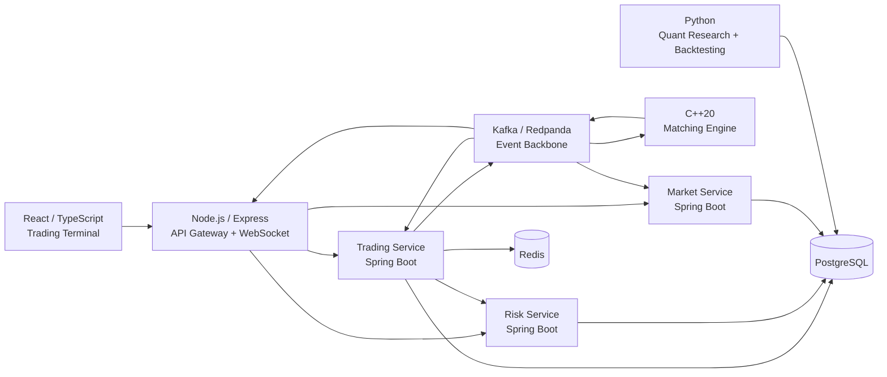

# TradeSphere

## Real-Time Paper Trading & Simulated Exchange Platform

TradeSphere is a production-oriented, event-driven paper-trading and simulated exchange platform built to demonstrate distributed systems, backend engineering, market infrastructure, low-level order matching, quantitative research, and real-time application development.

The system combines a React trading terminal, Node.js API Gateway, Java/Spring Boot services, a C++20 matching engine, Kafka-compatible event streaming, PostgreSQL, Redis, Kubernetes, Helm, and a Python quantitative research and backtesting layer.

> **Scope:** TradeSphere is a simulated trading environment. It does not execute real financial transactions or connect to a real exchange.

---

## Architecture



### Core order flow

```text
React Trading Terminal
        |
        v
Node.js API Gateway
        |
        v
Trading Service
        |
        +----> Risk Service
        |
        v
Kafka / Redpanda
        |
        v
C++20 Matching Engine
        |
        +----> trade.executed
        |
        +----> order events
                 |
                 +----> Trading Service
                 +----> Market Service
                 +----> API Gateway / WebSocket
```

The matching engine is not directly coupled to the Java trading service. Orders are routed through Kafka, allowing the matching engine to operate as an independent execution component.

---

# Key Engineering Features

- Real-time paper trading terminal
- Event-driven order processing
- C++20 deterministic matching engine
- Price-time-priority order book
- Partial and full order fills
- Order cancellation
- Trade generation
- Kafka / Redpanda event streaming
- Spring Boot trading, risk, and market services
- Pre-trade risk validation
- Buying-power and position checks
- Portfolio and position management
- Real-time market data
- WebSocket market updates
- PostgreSQL persistence
- Redis order caching
- Idempotent / duplicate client-order handling
- Python quantitative research layer
- Strategy-based backtesting
- Commission and slippage modeling
- Quantitative performance and risk metrics
- C++ matching-engine benchmarks
- Unit, integration, and end-to-end testing
- Prometheus-compatible metrics
- Health, readiness, and liveness checks
- Containerized services
- Kubernetes deployment manifests
- Helm deployment configuration

---

# System Components

## 1. React / TypeScript Trading Terminal

The frontend provides the interactive trading interface.

### Capabilities

- Instrument selection
- Market price display
- Bid / ask information
- Historical market data
- Price chart
- Order submission
- Buy / sell order flow
- Open orders
- Order history
- Trade history
- Portfolio information
- Position information
- Paper-account balance
- Real-time trade updates
- WebSocket connection status

The frontend communicates with the backend through the API Gateway and receives real-time execution updates through WebSockets.

---

# 2. Node.js / Express API Gateway

The API Gateway provides the external application boundary for the frontend.

### Responsibilities

- HTTP API routing
- Backend-for-Frontend functionality
- Service proxying
- Request handling
- Error handling
- Health endpoints
- WebSocket server
- Kafka trade-event consumption
- Real-time event broadcasting

The WebSocket layer subscribes to Kafka trade events and forwards relevant market events to connected trading clients.

Example WebSocket channel:

```text
market:{instrumentId}
```

This allows the frontend to receive market updates without continuously polling backend services.

---

# 3. Trading Service

The Trading Service is implemented using Java and Spring Boot.

It owns the core trading-domain state and coordinates the order lifecycle.

### Responsibilities

- Order creation
- Order validation
- Client-order identification
- Duplicate-order handling
- Order persistence
- Order lifecycle management
- Risk-service integration
- Publishing order commands
- Processing execution events
- Position updates
- Portfolio calculations
- Account state management

### Order lifecycle

Orders can move through states including:

```text
CREATED
   |
   v
PENDING_RISK
   |
   v
ACCEPTED
   |
   v
ROUTED
   |
   +----> PARTIALLY_FILLED
   |             |
   |             v
   +---------> FILLED
   |
   +----> CANCELLED
   |
   +----> REJECTED
```

The exact lifecycle depends on validation, risk checks, routing, execution, and subsequent execution events.

---

# 4. Pre-Trade Risk Service

The Risk Service is implemented using Spring Boot.

It provides a separate risk-validation boundary between order submission and order execution.

### Current validation logic includes

- Account must be active
- BUY orders must satisfy available buying power
- SELL orders must satisfy available position quantity

The Trading Service communicates with the Risk Service before routing an order to the matching engine.

```text
Order
  |
  v
Validation
  |
  v
Risk Service
  |
  +---- Rejected
  |
  +---- Approved
          |
          v
    Kafka order.commands
```

This separates risk policy from order execution logic.

---

# 5. C++20 Matching Engine

The matching engine is the low-level execution component of TradeSphere.

It is implemented in C++20 and consumes order commands through Kafka.

### Core responsibilities

- Maintain bid and ask order books
- Match compatible orders
- Enforce price-time priority
- Handle partial fills
- Handle full fills
- Handle cancellations
- Track remaining quantity
- Generate trade records
- Generate execution events
- Maintain order lookup structures

### Price-time priority

Orders are prioritized using:

1. Better price
2. Earlier arrival time at the same price

For bids:

```text
Highest price first
```

For asks:

```text
Lowest price first
```

At the same price level, earlier resting orders receive priority.

---

# Matching Engine Data Structures

The matching engine maintains separate bid and ask structures and an order-ID lookup structure.

The implementation supports operations such as:

```text
Submit Order
Cancel Order
Find Order
Match Orders
Generate Trade
Update Remaining Quantity
```

The order book supports partial execution, where an incoming order can consume only part of a resting order's remaining quantity.

---

# Trade Generation

When compatible orders cross, the matching engine generates a trade containing information such as:

- Trade ID
- Taker order
- Maker order
- Instrument
- Execution price
- Execution quantity

Trade events are then published through Kafka for downstream processing.

---

# 6. Kafka / Redpanda Event Backbone

Kafka-compatible event streaming decouples the execution engine from downstream services.

### `order.commands`

```text
Trading Service
      |
      v
order.commands
      |
      v
C++ Matching Engine
```

The topic carries order information such as:

- Order ID
- Account ID
- Instrument ID
- Side
- Order type
- Time in force
- Price
- Quantity

### `trade.executed`

```text
Matching Engine
      |
      v
trade.executed
      |
      +----> Trading Service
      +----> Market Service
      +----> API Gateway
```

Trade events contain:

- Trade ID
- Taker order ID
- Maker order ID
- Instrument ID
- Execution price
- Execution quantity
- Timestamp

This event-driven design avoids a direct synchronous dependency between the trading application and the C++ execution engine.

---

# 7. Market Data Service

The Market Service is implemented using Spring Boot and PostgreSQL.

It provides market information used by the trading terminal.

### Supported market-data operations

```text
GET /api/v1/market-data/{instrumentId}/latest
GET /api/v1/market-data/{instrumentId}/history
```

Market data includes information such as:

- Instrument
- Price
- Quantity
- Bid price
- Ask price
- Timestamp

Historical market ticks are persisted in PostgreSQL and exposed through the API Gateway.

---

# 8. Real-Time WebSocket Updates

Trade execution events are propagated from Kafka to the API Gateway and then broadcast to connected frontend clients.

```text
Matching Engine
      |
      v
Kafka
      |
      v
API Gateway
      |
      v
WebSocket
      |
      v
React Trading Terminal
```

This allows the UI to update market information and trading state as execution events arrive.

---

# 9. Portfolio & Position Management

Portfolio and position management is implemented inside the Trading Service rather than as a separate deployable microservice.

The system tracks:

- Position quantity
- Average entry price
- Cash
- Available balance
- Market value
- Realized P&L
- Unrealized P&L
- Total equity

Portfolio calculations combine account state, position state, and current market prices.

---

# 10. Account & Settlement Logic

The trading domain maintains simulated account state and applies execution results to the paper-trading account.

The system supports:

- BUY-side cash requirements
- SELL-side position requirements
- Position quantity updates
- Cash updates
- Execution-driven portfolio updates
- Simulated settlement behavior

All financial state is simulated and persisted within the application's trading domain.

---

# 11. PostgreSQL

PostgreSQL provides durable relational persistence.

The database contains domain state including:

- Accounts
- Instruments
- Orders
- Trades
- Positions
- Market ticks

The schema also defines controlled enumerations for concepts such as:

```text
Order Side
Order Type
Time in Force
Order Status
Account Status
Instrument Status
Asset Type
```

Example order types:

```text
MARKET
LIMIT
```

Example time-in-force values:

```text
DAY
GTC
IOC
FOK
```

---

# 12. Redis

Redis is used by the Trading Service for order caching.

The cache supports:

- Client-order lookup
- Duplicate-order handling
- Short-lived order state caching

Cached order entries use a time-to-live to prevent stale state from persisting indefinitely.

---

# 13. Python Quantitative Research Layer

TradeSphere includes a separate Python quantitative research and backtesting layer.

The layer provides a strategy-oriented framework for testing trading strategies against historical OHLCV-style data.

### Current strategy implementation

```text
SMA Crossover Strategy
```

The architecture separates:

```text
Market Data
     |
     v
Strategy
     |
     v
Signals
     |
     v
Backtest Engine
     |
     v
Equity Curve
     |
     v
Performance Metrics
```

---

# Backtesting

The backtesting engine supports configurable trading assumptions including:

- Initial capital
- Commission
- Slippage

This allows strategy performance to be evaluated under transaction-cost assumptions rather than using purely frictionless returns.

---

# Quantitative Performance Metrics

The research layer calculates metrics including:

- Total return
- Annualized return
- Annualized volatility
- Sharpe ratio
- Maximum drawdown
- Win rate
- Value at Risk
- Expected Shortfall
- Downside deviation

These metrics provide both performance and risk-oriented views of a strategy.

---

# 14. Performance Engineering

The C++ matching engine includes a dedicated benchmark.

The benchmark uses a controlled workload consisting of:

```text
Warm-up orders:       10,000
Resting orders:      100,000
Measured orders:     100,000
```

The benchmark measures execution behavior using latency samples and reports:

- Average latency
- p50 latency
- p95 latency
- p99 latency
- Maximum latency
- Throughput

The benchmark is intended to evaluate the matching engine under a large in-memory order-book workload.

Performance numbers are intentionally not hard-coded into this README; benchmark results depend on the machine and execution environment used.

---

# 15. Testing

TradeSphere contains tests across the major components.

## C++ matching-engine tests

The C++ project uses CMake testing support and includes test executables covering areas such as:

- Orders
- Order book behavior
- Order cancellation
- Matching engine behavior
- Trade generation
- Order commands

## Java tests

The backend services contain tests covering areas including:

- Order validation
- Duplicate-order handling
- Risk validation
- Reservation behavior
- Portfolio calculations
- Position calculations
- Trade-event processing

## Python tests

The quantitative layer includes tests for:

- OHLCV data validation
- SMA
- EMA
- Performance metrics
- Maximum drawdown
- Risk metrics
- SMA crossover strategy
- Backtesting

## End-to-end testing

The repository also contains an end-to-end order-flow test that exercises the trading system through the API Gateway and verifies resulting order state in PostgreSQL.

---

# 16. Observability & Operational Health

The Spring Boot services expose operational health and metrics through:

- Spring Boot Actuator
- Health endpoints
- Readiness checks
- Liveness checks
- Micrometer
- Prometheus-compatible metrics

Kubernetes deployments use health probes to detect service readiness and liveness.

---

# 17. Containerization

The project includes container build definitions for the major services.

Containerized components include:

- Web frontend
- API Gateway
- Trading Service
- Risk Service
- Market Service
- Matching Engine

The frontend uses a multi-stage container build with a production web-serving stage.

---

# 18. Kubernetes

TradeSphere includes Kubernetes deployment manifests for the application components and supporting infrastructure.

The Kubernetes configuration includes deployments and services for:

- Web frontend
- API Gateway
- Trading Service
- Risk Service
- Market Service
- C++ Matching Engine
- PostgreSQL
- Redis
- Kafka-compatible messaging infrastructure

Health probes and service configuration are included for the deployed components.

---

# 19. Helm

Helm configuration is included for repeatable Kubernetes deployment.

The Helm configuration manages values for components including:

- PostgreSQL
- Redis
- API Gateway
- Trading Service
- Risk Service
- Market Service
- Matching Engine
- Web frontend
- Kafka / Redpanda connectivity

This provides a deployment abstraction over the underlying Kubernetes manifests.

---

# Repository Structure

```text
TradeSphere/
│
├── apps/
│   ├── web/                         # React + TypeScript trading terminal
│   └── api-gateway/                 # Node.js + Express + WebSocket gateway
│
├── contracts/
│   └── schemas/                     # Event and command schemas
│
├── database/                        # Database schema and migrations
│
├── engine/
│   └── matching-engine/             # C++20 matching engine
│       ├── include/
│       ├── src/
│       ├── tests/
│       └── bench/
│
├── services/
│   ├── trading-service/             # Trading + portfolio + position domain
│   ├── risk-service/                # Pre-trade risk validation
│   └── market-service/              # Market data
│
├── quant/                            # Python research + backtesting
│   ├── backtesting/
│   ├── strategies/
│   └── tests/
│
├── infrastructure/
│   ├── kubernetes/                  # Kubernetes manifests
│   └── helm/                        # Helm deployment configuration
│
├── tests/
│   └── e2e/                         # End-to-end system tests
│
└── docs/                             # Architecture and event documentation
```

---

# Technology Stack

| Layer | Technology |
|---|---|
| Frontend | React, TypeScript |
| API Gateway | Node.js, Express.js |
| Real-Time Communication | WebSockets |
| Backend Services | Java 21, Spring Boot |
| Matching Engine | C++20 |
| Messaging | Kafka / Redpanda |
| Primary Database | PostgreSQL |
| Cache | Redis |
| Quant Research | Python |
| Backtesting | Python, NumPy, pandas |
| C++ Build System | CMake |
| C++ Testing | CTest |
| Backend Testing | JUnit |
| Python Testing | pytest |
| Containerization | Dockerfiles / Containerfiles |
| Orchestration | Kubernetes |
| Deployment Packaging | Helm |
| Observability | Spring Boot Actuator, Micrometer, Prometheus |

---

# Engineering Principles Demonstrated

## Separation of responsibilities

The system separates:

```text
Presentation
     ↓
API Gateway
     ↓
Trading Domain
     ↓
Risk
     ↓
Event Backbone
     ↓
Execution Engine
```

Each major responsibility has a defined service or subsystem.

---

## Event-driven architecture

Kafka provides asynchronous communication between the trading domain, matching engine, market data subsystem, and real-time gateway.

This reduces direct coupling between components and allows downstream consumers to process execution events independently.

---

## Low-level performance engineering

The matching engine is implemented in C++20 rather than the higher-level application stack.

The implementation focuses on:

- Order-book data structures
- Price-time priority
- Efficient order lookup
- Deterministic matching
- Partial fills
- Cancellation
- Benchmarking
- Latency percentile measurement

---

## Domain separation

Trading, risk, market data, execution, and quantitative research are separated into distinct components.

This allows each subsystem to use an implementation strategy appropriate to its responsibilities:

```text
React / TypeScript → User interaction
Node.js            → Gateway + real-time edge
Java / Spring      → Business domain
C++20              → Matching engine
Python             → Quantitative research
PostgreSQL         → Durable state
Redis              → Short-lived cache
Kafka / Redpanda   → Event transport
Kubernetes         → Deployment orchestration
```

---

# Architecture Rationale

### Why a separate C++ matching engine?

Order matching is a performance-sensitive, stateful component with specialized data structures and deterministic execution semantics. Implementing it separately allows the system to isolate execution logic from higher-level business services.

### Why Kafka / Redpanda?

The event backbone decouples order submission from execution and allows multiple downstream components to consume execution events.

### Why separate risk validation?

Risk checks represent a distinct business responsibility and should not be embedded directly into the low-level matching engine.

### Why Redis?

Frequently accessed order information can be cached for short-lived lookups while PostgreSQL remains the durable source of application state.

### Why Kubernetes and Helm?

The system contains multiple independently deployable services and infrastructure dependencies. Kubernetes provides orchestration while Helm provides parameterized deployment configuration.

### Why a separate Python research layer?

Quantitative research and backtesting have different runtime and development requirements from the production-style trading services. Keeping them separate allows strategy experimentation without coupling research code to the execution path.

---

# Engineering Concepts Demonstrated

TradeSphere brings together several areas of software engineering:

### Distributed Systems

- Service decomposition
- Asynchronous messaging
- Event-driven communication
- Service boundaries
- Event consumers
- Failure-aware service communication

### Backend Engineering

- REST APIs
- Domain modeling
- Persistence
- Validation
- Business logic
- Caching
- Service-to-service communication

### Systems Programming

- C++20
- Order-book data structures
- Price-time priority
- Deterministic matching
- Partial fills
- Cancellation
- Performance benchmarking

### Database Engineering

- Relational schema design
- Domain constraints
- Persistence
- Historical market data
- Transactional trading state

### Real-Time Systems

- Kafka event propagation
- WebSocket communication
- Real-time market updates
- Execution-event processing

### Quantitative Engineering

- Strategy abstraction
- Technical indicators
- Backtesting
- Transaction-cost modeling
- Performance metrics
- Risk metrics

### Infrastructure

- Containerized services
- Kubernetes
- Helm
- Service discovery
- Health probes
- Operational metrics

### Software Quality

- Unit testing
- Integration-oriented testing
- End-to-end testing
- CMake/CTest
- JUnit
- pytest

---

# Current Implementation Scope

TradeSphere currently focuses on:

- Real-time simulated trading
- Paper-account management
- Pre-trade risk validation
- Order lifecycle management
- Position tracking
- Portfolio calculations
- Market-data storage and retrieval
- Event-driven service communication
- C++ order matching
- Performance benchmarking
- Quantitative research
- Strategy backtesting
- Containerized deployment
- Kubernetes orchestration
- Automated component and end-to-end tests

The system is designed as an engineering project demonstrating how a trading platform can be decomposed into specialized services and execution components.

---

# What TradeSphere Is Not

TradeSphere is **not**:

- A real-money trading platform
- A connection to a production exchange
- A regulated brokerage
- A production financial infrastructure system
- A claim of exchange-scale throughput
- A colocated trading system
- An FPGA-based trading system
- A hardware-timestamped market-data system
- A replacement for real exchange infrastructure

The matching engine, trading services, risk controls, market data, and quantitative research components operate within a simulated environment.

---

# Summary

TradeSphere is a full-stack trading-system engineering project combining:

```text
React
  +
Node.js
  +
Spring Boot
  +
C++20
  +
Kafka / Redpanda
  +
PostgreSQL
  +
Redis
  +
Python
  +
Kubernetes
  +
Helm
```

The project demonstrates the integration of:

```text
Distributed Systems
       +
Backend Engineering
       +
Systems Programming
       +
Real-Time Communication
       +
Data Engineering
       +
Quantitative Research
       +
Performance Engineering
       +
Infrastructure
       +
Testing
```

The central engineering path is:

```text
User Order
    ↓
API Gateway
    ↓
Trading Service
    ↓
Risk Validation
    ↓
Kafka
    ↓
C++20 Matching Engine
    ↓
Trade Execution
    ↓
Kafka Events
    ↓
Trading / Market / WebSocket Consumers
    ↓
Portfolio + Market State + Real-Time UI
```

TradeSphere is intended to demonstrate end-to-end software engineering across application, service, systems, data, quantitative, and infrastructure layers.
